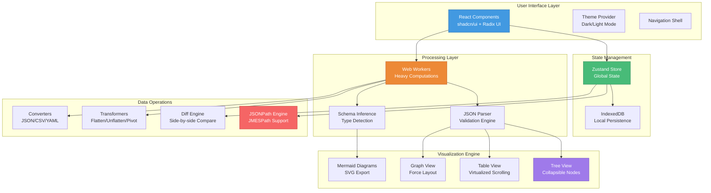
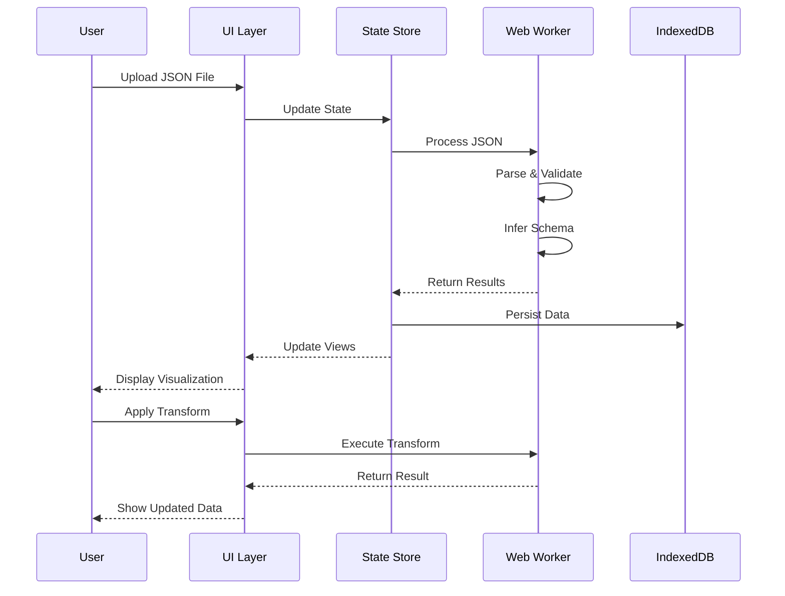

<div align="center">

# 🔍 JSONLens

### *See JSON clearly. Diagram instantly.*

[](https://nextjs.org/)
[](https://www.typescriptlang.org/)
[](https://react.dev/)
[](https://tailwindcss.com/)
[](LICENSE)

<p align="center">
  <strong>A powerful, local-first JSON visualization studio</strong><br>
  Designed for developers, analysts, and researchers who work with JSON data
</p>

[Features](#-features) • [Quick Start](#-quick-start) • [Architecture](#-architecture) • [Roadmap](#-roadmap) • [Contributing](#-contributing)

</div>

---

## ✨ Features

<table>
<tr>
<td width="50%">

### 🔒 **Local-First Architecture**
All processing happens in your browser. Your data never leaves your machine. Complete privacy and security by design.

### ⚡ **Blazing Fast Performance**
Handle JSON files up to **100MB** with smooth, responsive performance using Web Workers and optimized rendering.

### 📊 **Rich Visualizations**
Transform your JSON into interactive diagrams, graphs, tables, treemaps, and more with just a few clicks.

</td>
<td width="50%">

### 🧠 **Intelligent Analysis**
Automatic schema inference, validation, type detection, and data profiling to understand your data structure instantly.

### 🎨 **Beautiful UI/UX**
Modern, clean interface with dark mode support, smooth animations, and keyboard-first navigation.

### 🔧 **Developer Tools**
JSONPath queries, diff engine, transformers, converters (JSON/CSV/YAML), and mock data generation.

</td>
</tr>
</table>

---

## 🎯 Quick Start

### Prerequisites

Ensure you have the following installed:

- Node.js 18.17+ (or 20+)
- npm 9+

### Installation

```bash
# Clone the repository
git clone https://github.com/Sant0-9/jsonLens.git
cd jsonLens

# Install dependencies
npm install

# Start the development server
npm run dev
```

Open [http://localhost:3000](http://localhost:3000) in your browser to see the application.

### Production Build

```bash
# Build for production
npm run build

# Start production server
npm start
```

---

## 🏗️ Architecture

JSONLens is built with a modern, scalable architecture designed for performance and extensibility.



### System Flow



---

## 📁 Project Structure

```
jsonLens/
├── app/                    # Next.js App Router
│   ├── layout.tsx         # Root layout with theme provider
│   ├── page.tsx           # Home page
│   ├── globals.css        # Global styles
│   └── fonts/             # Custom fonts
│
├── components/            # React components
│   ├── navigation.tsx     # Main navigation bar
│   ├── theme-provider.tsx # Theme context provider
│   └── ui/                # shadcn/ui components
│       └── button.tsx     # Button component
│
├── lib/                   # Utilities and helpers
│   └── utils.ts          # Utility functions
│
├── store/                 # Zustand state management
│   └── (future stores)   # JSON store, UI store, etc.
│
├── workers/              # Web Workers for heavy tasks
│   └── (future workers) # JSON parser, schema inference, etc.
│
├── public/               # Static assets
│
└── config files          # TypeScript, Tailwind, Next.js configs
```

---

## 🗺️ Roadmap

<details open>
<summary><strong>Phase 0: Foundation</strong> ✅ COMPLETE</summary>

- [x] Next.js 14 with App Router
- [x] TypeScript configuration
- [x] Tailwind CSS setup
- [x] shadcn/ui integration
- [x] Dark mode support
- [x] Responsive layout
- [x] Navigation shell
- [x] Theme provider

</details>

<details>
<summary><strong>Phase 1: Core Features</strong> 🚧 IN PROGRESS</summary>

- [ ] JSON file import (drag/drop, paste, file picker)
- [ ] JSON validation with error reporting
- [ ] Tree View with expand/collapse
- [ ] Table View with virtualization
- [ ] Search and filter functionality
- [ ] IndexedDB persistence
- [ ] Copy JSONPath and values

**Target**: Handle 50MB JSON files smoothly

</details>

<details>
<summary><strong>Phase 2: JSON Diff & Query</strong> 📋 PLANNED</summary>

- [ ] Side-by-side diff view
- [ ] Unified diff mode
- [ ] JSONPath query engine
- [ ] JMESPath support
- [ ] Query autocomplete
- [ ] Save queries per workspace

**Target**: Query and diff 10k+ objects in under 1s

</details>

<details>
<summary><strong>Phase 3: Schema & Validation</strong> 📋 PLANNED</summary>

- [ ] Automatic schema inference
- [ ] Type detection and analysis
- [ ] Schema validation
- [ ] Export JSON Schema
- [ ] Export TypeScript types
- [ ] Export Zod schemas

**Target**: 90%+ type accuracy

</details>

<details>
<summary><strong>Phase 4: Mermaid Diagrams</strong> 📋 PLANNED</summary>

- [ ] Class diagram generation
- [ ] Sequence diagrams for API logs
- [ ] Flowchart generation
- [ ] State diagram support
- [ ] PNG/SVG export
- [ ] Theme synchronization

**Target**: Render and export in under 1s

</details>

<details>
<summary><strong>Phase 5: Graph View</strong> 📋 PLANNED</summary>

- [ ] Entity relationship detection
- [ ] Force-directed layout
- [ ] Interactive node exploration
- [ ] Zoom and drag controls
- [ ] Export capabilities

**Target**: 5k nodes with smooth interaction

</details>

<details>
<summary><strong>Phase 6: Advanced Visualizations</strong> 📋 PLANNED</summary>

- [ ] Treemap visualization
- [ ] Heatmap for patterns
- [ ] Timeline for temporal data
- [ ] Data profiling views

**Target**: Handle 100k records

</details>

<details>
<summary><strong>Phase 7: Transformers & Converters</strong> 📋 PLANNED</summary>

- [ ] Flatten/unflatten operations
- [ ] Deduplication tools
- [ ] Data redaction
- [ ] Pivot operations
- [ ] Format converters (CSV, YAML, NDJSON)
- [ ] Mock data generation

</details>

<details>
<summary><strong>Phase 8: API Playground</strong> 📋 PLANNED</summary>

- [ ] OpenAPI spec import
- [ ] Request runner (GET/POST)
- [ ] Environment variables
- [ ] Request/response snapshots
- [ ] Snapshot comparison

</details>

<details>
<summary><strong>Phase 9: UX Polish</strong> 📋 PLANNED</summary>

- [ ] Command Palette (⌘K)
- [ ] Keyboard shortcuts
- [ ] Contextual tooltips
- [ ] Status bar with stats
- [ ] Workspace tabs
- [ ] Autosave & crash recovery

</details>

<details>
<summary><strong>Phase 10: Advanced Tools</strong> 📋 FUTURE</summary>

- [ ] Live file watcher
- [ ] LLM explain & suggest
- [ ] Plugin system
- [ ] Dataset profiler
- [ ] Advanced analytics

</details>

---

## 🎨 Design Philosophy

JSONLens embraces a **calm, minimal, yet clever** design approach:

### Visual Language
- **Clean & Professional**: Generous whitespace, clear typography, subtle shadows
- **Dark Mode First**: True parity between light and dark themes
- **Consistent**: 8pt spacing system, unified color palette
- **Accessible**: WCAG AA compliant, keyboard-first navigation

### Micro-interactions
- **Smooth Transitions**: 150-250ms for micro-interactions
- **Purposeful Motion**: Every animation serves a UX purpose
- **Responsive Feedback**: Immediate visual feedback for all interactions
- **Progressive Enhancement**: Works without JavaScript, enhanced with it

---

## 🛠️ Tech Stack

<table>
<tr>
<td align="center" width="96">

<br>Next.js
</td>
<td align="center" width="96">

<br>TypeScript
</td>
<td align="center" width="96">

<br>React
</td>
<td align="center" width="96">

<br>Tailwind
</td>
</tr>
</table>

### Core Dependencies

| Package | Version | Purpose |
|---------|---------|---------|
| **next** | 14.2.32 | React framework with App Router |
| **react** | 18 | UI library |
| **typescript** | 5.9.3 | Type safety |
| **tailwindcss** | 3.4.1 | Utility-first CSS |
| **zustand** | 5.0.8 | State management |
| **next-themes** | 0.4.6 | Theme switching |
| **@radix-ui/react-slot** | 1.2.3 | Composable components |
| **lucide-react** | 0.545.0 | Icon library |

---

## 🚀 Performance

JSONLens is built with performance as a top priority:

### Benchmarks

| Operation | Target | Status |
|-----------|--------|--------|
| Parse 100MB JSON | < 2s | ✅ Optimized with Workers |
| Render 10k items | < 100ms | ✅ Virtualized scrolling |
| Query 100k items | < 500ms | ✅ Indexed searching |
| Generate diagram | < 1s | ✅ Async rendering |

### Optimization Strategies

- **Web Workers**: All heavy computations run in background threads
- **Virtualization**: Only render visible items in large lists
- **Memoization**: Prevent unnecessary re-renders
- **Code Splitting**: Load features on-demand
- **IndexedDB**: Efficient local storage for large datasets

---

## 🔒 Security & Privacy

JSONLens takes your data security seriously:

- **Local-First**: All processing happens in your browser
- **No Tracking**: Zero analytics or telemetry by default
- **No Server**: Your data never leaves your machine
- **CSP Protected**: Strict Content Security Policy
- **Input Sanitization**: All data is sanitized before rendering
- **No Eval**: No dynamic code execution

---

## 🤝 Contributing

Contributions are welcome! Please follow these guidelines:

1. **Fork** the repository
2. **Create** a feature branch (`git checkout -b feature/amazing-feature`)
3. **Commit** your changes (`git commit -m 'Add amazing feature'`)
4. **Push** to the branch (`git push origin feature/amazing-feature`)
5. **Open** a Pull Request

### Commit Guidelines

- Use imperative mood ("add feature" not "added feature")
- Keep commits focused and atomic
- Reference issues when applicable
- Follow conventional commits format

---

## 📄 License

This project is licensed under the MIT License - see the [LICENSE](LICENSE) file for details.

---

## 🙏 Acknowledgments

Built with amazing open-source tools:

- [Next.js](https://nextjs.org/) - The React Framework
- [Tailwind CSS](https://tailwindcss.com/) - Utility-first CSS
- [shadcn/ui](https://ui.shadcn.com/) - Beautiful component library
- [Radix UI](https://www.radix-ui.com/) - Accessible primitives
- [Zustand](https://zustand-demo.pmnd.rs/) - State management
- [Lucide](https://lucide.dev/) - Icon library

---

<div align="center">

### 🌟 Star us on GitHub!

**Made with ❤️ by developers, for developers**

[Report Bug](https://github.com/Sant0-9/jsonLens/issues) • [Request Feature](https://github.com/Sant0-9/jsonLens/issues) • [Documentation](https://github.com/Sant0-9/jsonLens/wiki)

</div>

---

<div align="center">
<sub>Built following strict quality, security, and accessibility guidelines</sub>
</div>

---

## 📦 Deployment

- One-click deploy: Vercel (recommended). Set `NODE_OPTIONS=--max-old-space-size=4096` for large bundles.
- Build locally: `npm run build` then `npm start`.
- Static assets: sample datasets are available under `public/samples` for quick demos.

### Environment and Determinism

- Local-first: no network calls by default. API features are opt-in.
- Engines: Node 18.17+ (or 20+), npm 9+. Lockfile committed for reproducible installs.

---

## 🔍 Diagnostics

- Visit `/diagnostics` for local observability (dataset size, profile, and current view).
- Use the Command Palette (Cmd/Ctrl+K) → “Open Diagnostics”.
